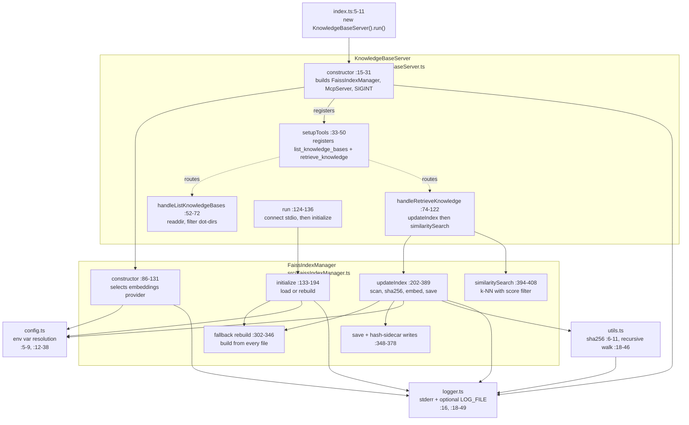

# C4 — Component

Zooming into the server process from [`c4-container.md`](./c4-container.md). Five TypeScript modules, one entry point. The dependency graph is acyclic and shallow — the indexer and the MCP server never call each other's internals, only public methods.

## Diagram

## Components

| Component              | File                              | Responsibility                                                                                     | Public surface touched elsewhere |
| ---------------------- | --------------------------------- | -------------------------------------------------------------------------------------------------- | -------------------------------- |
| `KnowledgeBaseServer`  | `src/KnowledgeBaseServer.ts`      | Owns the `McpServer`, registers tools, wires stdio transport, delegates every query to the indexer. | `run()` (called by `index.ts:5-11`). |
| `FaissIndexManager`    | `src/FaissIndexManager.ts`        | Picks an embedding provider, maintains one in-memory `FaissStore`, persists the index, rebuilds on model change, updates per-file sha256 sidecars. | `initialize()`, `updateIndex(kb?)`, `similaritySearch(q, k, threshold)`. |
| `config`               | `src/config.ts`                   | Resolves every env var into a typed constant. No runtime side-effects beyond reading `process.env`. | Imported wherever an env var is read. |
| `logger`               | `src/logger.ts`                   | **Stderr-only** logger with optional `LOG_FILE` mirror. Writing to stdout would corrupt JSON-RPC — see `src/logger.ts:16`. | Imported by every component. |
| `utils`                | `src/utils.ts`                    | `calculateSHA256(file)` and `getFilesRecursively(dir)` — the latter skips dot-prefixed entries. | Imported by `FaissIndexManager`. |

## Key cross-component interactions

### Request path

`handleRetrieveKnowledge` at `src/KnowledgeBaseServer.ts:74-122` calls **two** indexer methods in order:

1. `updateIndex(knowledge_base_name?)` — `src/KnowledgeBaseServer.ts:84` → `src/FaissIndexManager.ts:202-389`. Runs on **every** request; scans the KB, re-hashes files, re-embeds what changed, saves once.
2. `similaritySearch(query, 10, threshold)` — `src/KnowledgeBaseServer.ts:88` → `src/FaissIndexManager.ts:394-408`. Runs only if `updateIndex` left `faissIndex` non-null; throws otherwise.

End-to-end in [`sequence-retrieve.md`](./sequence-retrieve.md).

### Startup path

`index.ts:5` constructs the server (which constructs the indexer, which constructs the embeddings client — `src/FaissIndexManager.ts:86-131`). `run()` at `src/KnowledgeBaseServer.ts:124-136` connects stdio **before** `initialize()` runs. That ordering matters: the MCP handshake completes against an un-initialized indexer; the first `retrieve_knowledge` call may therefore find a partially-initialized state and the `updateIndex` fallback at `src/FaissIndexManager.ts:302-346` handles it.

### Model-change path

`initialize()` at `src/FaissIndexManager.ts:153-164` compares `model_name.txt` to the current configured model; on mismatch it deletes `faiss.index`, sets `faissIndex = null`, and lets the next `updateIndex` rebuild from scratch via the fallback block. Full flow in [`sequence-reindex.md`](./sequence-reindex.md).

## Dependency rules in force

- **No cycles.** `KnowledgeBaseServer` depends on `FaissIndexManager`, not vice-versa.
- **`logger` has no upstream deps.** Everyone imports it; it imports nothing inside `src/`. This keeps the stdout-safety invariant local to one file.
- **`config` is pure.** It reads `process.env` once at module load; consumers import constants, not functions. (Exception: `huggingFaceRouterUrl` at `src/config.ts:29-34` is a pure helper called only from inside the module.)
- **`utils` is stateless.** No module-level cache.
