# C4 — Component

Zooming into the package from [`c4-container.md`](./c4-container.md). The current source tree is still organized around three orchestration surfaces: the MCP server, the `kb` CLI dispatcher, and `FaissIndexManager`. The implementation below those surfaces is broader than the first architecture snapshot: retrieval now includes dense, lexical, hybrid, reranking, gate, metrics, FAISS/HNSW backends, and multiple operator workflows.

## Diagram

```mermaid
flowchart TB
  Entry["index.ts<br/>server process entrypoint"]
  CLI["cli.ts<br/>35-command kb dispatcher"]

  subgraph cli["CLI command families"]
    ReadCli["read/search<br/>list, search, open, related, stats, explain, where"]
    WriteCli["KB writes<br/>remember, capture, import-url, ask --save-transcript"]
    OpsCli["operations<br/>doctor, logs, backup, restore, verify, quarantine, stale-check, superseded, promote"]
    EvalCli["evaluation<br/>eval, eval-gate, feedback, research"]
    ModelCli["models and services<br/>models, compare, reindex, cache, llm, serve, config, completion"]
    CliShared["cli-shared.ts / *-core.ts<br/>shared command-independent helpers"]
  end

  subgraph server["MCP runtime"]
    KBS["KnowledgeBaseServer.ts<br/>tools, resources, prompts, transports"]
    ToolSpecs["mcp-tool-specs.ts<br/>tool schema source of truth"]
    Resources["mcp-resources.ts<br/>kb:// list/read"]
    Prompts["mcp-prompts.ts<br/>optional prompt templates"]
    Http["transport/http.ts + transport/sse.ts<br/>remote MCP hosts"]
    Watchers["triggerWatcher.ts + recursive-fs-watch.ts<br/>optional refresh triggers"]
  end

  subgraph retrieval["Retrieval and answering"]
    FIM["FaissIndexManager.ts<br/>model-scoped ingest/search/stats"]
    SearchCore["search-core.ts / hybrid-retrieval.ts / lexical-index.ts<br/>dense, lexical, hybrid retrieval"]
    Ask["ask-core.ts / llm-client.ts<br/>answer generation"]
    Gate["relevance-gate.ts / reranker.ts<br/>optional post-retrieval stages"]
    Formatter["formatter.ts / injection-guard.ts<br/>wire formatting and untrusted-content guard"]
  end

  subgraph storage["Storage and indexing"]
    Active["active-model.ts<br/>model registry and active model"]
    Layout["faiss-store-layout.ts<br/>versioned index load/save"]
    FaissAdapter["faiss-store-adapter.ts<br/>FAISS backend adapter"]
    HnswAdapter["hnsw-index-adapter.ts<br/>HNSW backend adapter"]
    DocstoreCas["docstore-cas.ts<br/>docstore hardlink CAS"]
    FileIngest["file-ingest.ts / loaders.ts<br/>chunking, manifests, loaders"]
    KbFs["kb-fs.ts / kb-paths.ts / ingest-filter.ts<br/>KB enumeration and path safety"]
  end

  subgraph cross["Cross-cutting"]
    Config["config/*.ts + transport-config.ts<br/>env/config schema"]
    Lock["write-lock.ts<br/>per-model and sidecar locks"]
    Logs["logger.ts / canonical-log.ts<br/>stderr, canonical logs"]
    Metrics["metrics.ts / prometheus-export.ts / otel-trace.ts<br/>observability"]
    Errors["errors.ts / error-utils.ts<br/>typed errors"]
  end

  Entry --> KBS
  CLI --> ReadCli
  CLI --> WriteCli
  CLI --> OpsCli
  CLI --> EvalCli
  CLI --> ModelCli
  ReadCli --> CliShared
  WriteCli --> CliShared
  OpsCli --> CliShared
  EvalCli --> CliShared
  ModelCli --> CliShared
  CliShared --> FIM
  CliShared --> Active

  KBS --> ToolSpecs
  KBS --> Resources
  KBS --> Prompts
  KBS --> Http
  KBS --> Watchers
  KBS --> FIM
  KBS --> Ask
  KBS --> Gate
  KBS --> Formatter

  FIM --> SearchCore
  FIM --> Active
  FIM --> Layout
  FIM --> FileIngest
  FIM --> KbFs
  Layout --> FaissAdapter
  Layout --> HnswAdapter
  Layout --> DocstoreCas
  SearchCore --> Formatter
  Ask --> SearchCore

  KBS --> Config
  CLI --> Config
  FIM --> Config
  KBS --> Lock
  CLI --> Lock
  FIM --> Lock
  KBS --> Logs
  CLI --> Logs
  FIM --> Logs
  KBS --> Metrics
  SearchCore --> Metrics
  KBS --> Errors
  FIM --> Errors
```

## Components

| Component | File | Responsibility | Public surface touched elsewhere |
| --- | --- | --- | --- |
| Process entrypoint | `src/index.ts` | Constructs `KnowledgeBaseServer`, runs it, and converts top-level failures to process exit code 1. | Package `knowledge-base-mcp-server` bin. |
| MCP server | `src/KnowledgeBaseServer.ts` | Registers MCP tools/resources/prompts, resolves model managers, coordinates retrieval/ask/write handlers, starts stdio/SSE/HTTP transports, warmup, shutdown, and reindex watchers. | `KnowledgeBaseServer.run()` from the process entrypoint. |
| MCP tool specs | `src/mcp-tool-specs.ts` | Single source of truth for MCP tool names, descriptions, input schemas, and ingest gating. | Used by server registration and generated `docs/reference/mcp-tools.md`. |
| MCP resources and prompts | `src/mcp-resources.ts`, `src/mcp-prompts.ts` | Expose `kb://` source-document list/read and optional prompt templates. | Registered from `KnowledgeBaseServer.buildMcpServer()`. |
| Remote transports | `src/transport/http.ts`, `src/transport/sse.ts`, `src/transport/base-http-host.ts`, `src/transport-config.ts` | Host streamable HTTP/SSE sessions with bearer auth, origin checks, backoff, runtime counters, and health/metrics endpoints. | Selected by `MCP_TRANSPORT`. |
| CLI dispatcher | `src/cli.ts` | Loads package `.env`, owns help/version/daemon routing, and dispatches 35 subcommands from the `SUBCOMMANDS` registry. | Package `kb` bin and generated `docs/reference/cli.md`. |
| CLI command modules | `src/cli-*.ts` | Implement shell workflows: search/list/open/related, ask/remember/capture/import-url, model management, diagnostics, logs, backup/restore, eval/feedback/research, daemon/service helpers, cache, config, and completion. | Called only by `src/cli.ts` or other CLI modules. |
| Shared CLI/core helpers | `src/cli-shared.ts`, `src/*-core.ts` | Keep command-independent logic reusable by CLI, MCP, tests, and benchmarks. | Used by CLI handlers and selected server paths. |
| FAISS index manager | `src/FaissIndexManager.ts` | Model-scoped owner of embedding clients, ingest/update, sidecars, backend load/save, similarity search, stats, and chunk metadata shaping. | Constructed by CLI shared loading, `ManagerRegistry`, and read-only server helpers. |
| Search backends | `src/faiss-store-adapter.ts`, `src/hnsw-index-adapter.ts`, `src/search-index-adapter.ts` | Present FAISS and HNSW stores behind a shared search-index adapter surface. | Loaded/saved by `faiss-store-layout.ts`, queried by `FaissIndexManager`. |
| Versioned store layout | `src/faiss-store-layout.ts` | Owns `index -> index.vN` load/save, backend/integrity manifests, legacy fallback, symlink swaps, retention pruning, and HNSW/FAISS backend dispatch. | Used by `FaissIndexManager` and diff/verify flows. |
| Docstore CAS | `src/docstore-cas.ts` | Canonicalizes FAISS `docstore.json` payloads and hardlinks identical docstores through `$FAISS_INDEX_PATH/.docstore-cas/`. | Called during FAISS atomic saves. |
| Active model store | `src/active-model.ts` | Single owner of `models/<id>/` paths, registered-model discovery, `model_name.txt`, `index-type.txt`, incomplete-add state, and `active.txt` resolution/writes. | Used by CLI, MCP server, manager registry, and FAISS manager. |
| Ingest and loaders | `src/file-ingest.ts`, `src/loaders.ts`, `src/ingest-quarantine.ts`, `src/secret-scanner.ts` | Build chunks/manifests, route extension-specific extraction, quarantine failed/secret-bearing files, and write sidecars. | Used by `FaissIndexManager` and inspect/doctor surfaces. |
| Retrieval composition | `src/search-core.ts`, `src/hybrid-retrieval.ts`, `src/lexical-index.ts`, `src/rrf.ts`, `src/retrieval-views.ts` | Implement dense, lexical, hybrid RRF, retrieval views, scoring/diagnostics, and fallback/degradation behavior. | Used by CLI search, MCP retrieval, eval, and research flows. |
| Answering and relevance | `src/ask-core.ts`, `src/llm-client.ts`, `src/relevance-gate.ts`, `src/reranker.ts` | Pack retrieval context, call local/OpenAI-compatible LLMs, optionally gate/rerank candidates, and report timing/provenance. | Used by CLI `ask`, MCP `ask_knowledge`, MCP/CLI retrieval, eval-gate. |
| Formatting and content guard | `src/formatter.ts`, `src/injection-guard.ts`, `src/kb-shield.ts` | Sanitize metadata, format markdown/JSON retrieval output, and tag/wrap untrusted retrieved content. | Used by CLI and MCP retrieval surfaces. |
| KB filesystem helpers | `src/kb-fs.ts`, `src/kb-paths.ts`, `src/file-utils.ts`, `src/ingest-filter.ts` | List KBs, validate names/paths, walk files, hash content, and apply inclusion/exclusion rules. | Used by CLI, MCP resources/writes, and FAISS manager. |
| Locking and lifecycle | `src/write-lock.ts`, `src/manager-registry.ts`, `src/triggerWatcher.ts`, `src/recursive-fs-watch.ts` | Serialize mutating index/sidecar paths, cache managers per model, and trigger refreshes from polling/fs-watch inputs. | Used by server and CLI mutation/refresh flows. |
| Observability and diagnostics | `src/logger.ts`, `src/canonical-log.ts`, `src/metrics.ts`, `src/prometheus-export.ts`, `src/otel-trace.ts`, `src/kb-stats.ts` | Keep stdout clean, emit canonical events, expose stats/metrics/traces, and power doctor/logs/stats surfaces. | Used across CLI/MCP runtime modules. |
| Configuration and errors | `src/config/*.ts`, `src/errors.ts`, `src/error-utils.ts`, `src/ollama-error.ts` | Resolve env/config defaults, validate schemas, and translate provider/filesystem failures into stable operator-facing errors. | Imported by runtime modules and generated config docs. |

## Key Cross-Component Interactions

### Request Path

`retrieve_knowledge` is registered in `src/KnowledgeBaseServer.ts` from schemas in `src/mcp-tool-specs.ts`. At request time, `handleRetrieveKnowledge` resolves the active or explicit model, loads a model manager from `ManagerRegistry`, refreshes under the per-model write lock for MCP retrieval, queries dense or hybrid retrieval, applies optional relevance gate/reranker stages, and formats through `formatRetrievalAsMarkdown()`.

### Startup Path

`src/index.ts` calls `server.run()`. `KnowledgeBaseServer.run()` bootstraps the index layout, validates transport config, then starts stdio, SSE, or streamable HTTP. Active-manager warmup and file/trigger watchers are optional runtime concerns, not persistence owners.

### Model Layout Path

`active-model.ts` owns the filesystem schema and active resolution rules: model directory derivation, registration checks, `model_name.txt`, `index-type.txt`, `.adding`, and `active.txt`. New model-loading code should read model metadata there instead of reconstructing paths or assuming the process-level `KB_INDEX_TYPE`.

### Index Persistence Path

`FaissIndexManager.initialize()` creates embeddings lazily and loads the current backend. The manager delegates versioned persistence to `loadFaissStoreAtomic()` / `saveFaissStoreAtomic()` and `loadHnswIndexAtomic()` / `saveHnswIndexAtomic()` in `src/faiss-store-layout.ts`. The layout helpers prefer the RFC 014 symlink layout, fall back to legacy FAISS when valid, write new `index.vN/` directories, atomically swap `index`, and prune old versions.

### CLI Path

`src/cli.ts` is the dispatcher. Command-specific behavior lives in `src/cli-*.ts`; shared manager loading and process-capture helpers live in `src/cli-shared.ts`; command-independent logic belongs in `*-core.ts` modules so non-CLI runtime code does not depend on CLI adapters.

## Dependency Rules In Force

- **No source import cycles.** Production modules should remain acyclic; keep orchestration modules at the edge.
- **Runtime orchestration points outward.** `KnowledgeBaseServer` and `cli.ts` may depend on indexing/model/filesystem helpers; those helpers should not import either orchestration surface.
- **Non-CLI modules never import `cli-*` adapters.** Only `cli.ts` and `cli-*.ts` command modules may import a `cli-*` adapter. Shared, server, and transport modules import command-independent `*-core` modules (`search-core.ts`, `search-errors-core.ts`, `timing-core.ts`) instead. `src/non-cli-import-boundary.test.ts` scans production modules for regressions.
- **`logger` remains a leaf.** It has no source imports and must continue writing logs away from stdout.
- **`active-model.ts` is the model layout authority.** New code should not reconstruct `models/<id>/` paths, `model_name.txt`, or `index-type.txt` independently.
- **Versioned store layout is not embedded in the manager.** Backend-specific load/save behavior belongs in `faiss-store-layout.ts`; `FaissIndexManager` remains the ingest/search orchestrator.
- **Shared helpers are domain-scoped.** Prefer existing domain helpers over broad utility barrels.
- **Config is read at module load except transport validation.** `loadTransportConfig()` in `src/transport-config.ts` is the explicit startup validation boundary for MCP transport settings.
