# C4 — Component

Zooming into the server process from [`c4-container.md`](./c4-container.md). The current source tree is an acyclic set of focused helpers around three orchestration surfaces: the MCP server, the FAISS index manager, and the CLI.

## Diagram

```mermaid
flowchart TB
  Entry["index.ts:1-11<br/>process entrypoint"]
  CLI["cli.ts:62-150<br/>kb command dispatcher"]

  subgraph cli["CLI handlers"]
    CliList["cli-list.ts:1-15<br/>list command"]
    CliSearch["cli-search.ts:37-250<br/>search command"]
    CliCompare["cli-compare.ts:1-125<br/>compare command"]
    CliModels["cli-models.ts:22-327<br/>models command"]
    CliShared["cli-shared.ts:1-52<br/>CLI manager loading"]
  end

  subgraph server["MCP runtime"]
    KBS["KnowledgeBaseServer.ts:191-790<br/>tools, resources, transports, warmup"]
    SSE["transport/sse.ts:52-418<br/>SSE host and session dispatch"]
    Watcher["triggerWatcher.ts:41-209<br/>polling reindex trigger"]
  end

  subgraph index["Indexing and retrieval"]
    FIM["FaissIndexManager.ts:244-1413<br/>provider, ingest, search, stats"]
    FaissLayout["faiss-store-layout.ts:13-211<br/>versioned FAISS load/save"]
    Loaders["loaders.ts:28-101<br/>extension-routed file loading"]
    Format["formatter.ts:25-88<br/>retrieval wire formatting"]
    Lock["write-lock.ts:17-72<br/>per-resource write locks"]
  end

  subgraph model["Model and KB filesystem"]
    Active["active-model.ts:32-381<br/>model dirs, registration, active resolution"]
    ModelId["model-id.ts:8-66<br/>model id parsing and validation"]
    KbFs["kb-fs.ts:11-90<br/>KB listing and document path resolution"]
    FileUtils["file-utils.ts:6-46<br/>SHA256 and recursive walk"]
    IngestFilter["ingest-filter.ts:31-237<br/>ingestable path rules"]
    KbPaths["kb-paths.ts:13-104<br/>KB name and safe path validation"]
    Frontmatter["frontmatter.ts:16-83<br/>YAML frontmatter parsing"]
    ErrorUtils["error-utils.ts:1-23<br/>unknown-to-Error coercion"]
  end

  Config["config.ts:5-280<br/>env-derived runtime config"]
  Logger["logger.ts:14-74<br/>stderr logger + optional file mirror"]
  Errors["errors.ts:1-23<br/>typed KB errors"]
  OllamaErr["ollama-error.ts:34-108<br/>Ollama retry/error translation"]
  Costs["cost-estimates.ts:11-60<br/>CLI model-add estimates"]

  Entry --> KBS
  CLI --> FIM
  CLI --> CliList
  CLI --> CliSearch
  CLI --> CliCompare
  CLI --> CliModels
  CliList --> KbFs
  CliSearch --> Active
  CliSearch --> FIM
  CliSearch --> Format
  CliSearch --> Lock
  CliSearch --> FileUtils
  CliSearch --> IngestFilter
  CliSearch --> CliShared
  CliCompare --> Active
  CliCompare --> FIM
  CliCompare --> Format
  CliCompare --> CliShared
  CliModels --> Active
  CliModels --> FIM
  CliModels --> KbFs
  CliModels --> Lock
  CliModels --> Costs
  CliModels --> FileUtils
  CliModels --> IngestFilter
  CliShared --> FIM

  KBS --> FIM
  KBS --> Active
  KBS --> Config
  KBS --> Format
  KBS --> KbFs
  KBS --> Lock
  KBS --> SSE
  KBS --> Watcher
  KBS --> ErrorUtils
  KBS --> FileUtils
  KBS --> IngestFilter
  KBS --> KbPaths
  KBS --> Errors

  FIM --> Active
  FIM --> Config
  FIM --> Errors
  FIM --> KbFs
  FIM --> FaissLayout
  FIM --> FileUtils
  FIM --> Frontmatter
  FIM --> IngestFilter
  FIM --> Loaders
  FIM --> Logger
  FIM --> ModelId
  FIM --> OllamaErr
  FIM --> ErrorUtils

  Active --> Config
  Active --> Logger
  Active --> ModelId
  KbFs --> KbPaths
  SSE --> Config
  SSE --> Logger
  Watcher --> Logger
  FaissLayout --> Logger
  FileUtils --> Logger
  IngestFilter --> Logger
  Lock --> Logger
  OllamaErr --> Errors
```

## Components

| Component | File | Responsibility | Public surface touched elsewhere |
| --- | --- | --- | --- |
| Process entrypoint | `src/index.ts:1-11` | Constructs `KnowledgeBaseServer`, runs it, and converts top-level failures to process exit code 1. | Imported by no source module. |
| MCP server | `src/KnowledgeBaseServer.ts:191-790` | Registers MCP tools/resources, resolves model managers, coordinates retrieval, starts stdio/SSE transports, warmup, shutdown, and reindex watcher. | `KnowledgeBaseServer.run()` from `src/index.ts:8`. |
| FAISS index manager | `src/FaissIndexManager.ts:244-1413` | Owns embedding provider instances, ingest/update, search, index stats, and chunk metadata shaping. | `initialize()`, `updateIndex()`, `similaritySearch()`, `stats()`, `resolveActiveIndexFilePath()`. |
| FAISS store layout | `src/faiss-store-layout.ts:13-211` | Owns versioned FAISS `index -> index.vN` load/save, legacy fallback, symlink swaps, and version garbage collection. | Used by FAISS manager wrappers and active-model index path resolution. |
| CLI dispatcher | `src/cli.ts:62-150` | Implements help/version handling, subcommand dispatch, and process-driver detection for the `kb` binary. | `main(argv)` and the package `bin` entries in `package.json:5-9`. |
| CLI search handler | `src/cli-search.ts:37-250` | Parses search args, optionally refreshes under the write lock, runs similarity search, and reports staleness. | Called only by the CLI dispatcher. |
| CLI model handler | `src/cli-models.ts:22-327` | Handles model list/add/set-active/remove, cost estimates, model registration, active model writes, and incomplete-add cleanup. | Called only by the CLI dispatcher. |
| CLI compare/list/shared helpers | `src/cli-compare.ts:1-125`, `src/cli-list.ts:1-15`, `src/cli-shared.ts:1-52` | Keep compare/list output and CLI manager loading separate from search/model flows. | Called only by CLI handlers. |
| Active model store | `src/active-model.ts:32-381` | Single owner of `models/<id>/` paths, registered-model discovery, active-model resolution, and `active.txt` writes. | Used by CLI, MCP server, and FAISS manager. |
| Model id helpers | `src/model-id.ts:8-66` | Validates and derives provider-qualified model ids. | Used by active-model, CLI, FAISS manager, and cost estimates. |
| KB filesystem helpers | `src/kb-fs.ts:11-90` | Lists KB directories and resolves exposed MCP resource document paths. | Used by CLI, MCP server, and FAISS manager. |
| File utilities | `src/file-utils.ts:6-46` | SHA256 hashing and recursive, dotfile-skipping file walks. | Used by CLI handlers and FAISS manager. |
| Ingest filter | `src/ingest-filter.ts:31-237` | Applies corpus inclusion/exclusion rules and public skipped-filename patterns. | Used by CLI handlers, MCP server, and FAISS manager. |
| KB path validation | `src/kb-paths.ts:13-104` | Validates KB names and resolves user document paths without traversal or symlink escape. | Used by MCP server and KB FS. |
| Frontmatter parser | `src/frontmatter.ts:16-83` | Parses bounded FAILSAFE YAML frontmatter into tags/body/raw object. | Used by FAISS manager chunk metadata shaping. |
| Error utilities | `src/error-utils.ts:1-23` | Converts unknown thrown values into stable `Error` instances at catch boundaries. | Used by MCP server and FAISS manager. |
| Config | `src/config.ts:5-280` | Reads env-derived runtime config at module load and validates SSE transport settings on startup. | Used by most runtime modules. |
| Formatter | `src/formatter.ts:25-88` | Sanitizes metadata and formats retrieval results as markdown/JSON. | Used by CLI and MCP server. |
| Loaders | `src/loaders.ts:28-101` | Routes file loading by extension for plain text, PDF, and HTML. | Used by FAISS manager. |
| Write lock | `src/write-lock.ts:17-72` | Serializes write paths with `proper-lockfile`. | Used by CLI and MCP server. |
| SSE host | `src/transport/sse.ts:52-418` | Hosts MCP-over-SSE sessions with auth/origin checks and per-session `McpServer` instances. | Used by `KnowledgeBaseServer.runSse()`. |
| Trigger watcher | `src/triggerWatcher.ts:41-209` | Polls a trigger file and requests reindexing when mtime changes. | Used by `KnowledgeBaseServer.startTriggerWatcher()`. |
| Logger | `src/logger.ts:14-74` | Writes logs to stderr and optional `LOG_FILE`, preserving stdout for JSON-RPC/CLI output. | Imported by runtime modules. |
| Error taxonomy | `src/errors.ts:1-23` | Defines `KBError` codes for operator-facing failure paths. | Used by FAISS manager, MCP server, and Ollama error translation. |
| Ollama error translation | `src/ollama-error.ts:34-108` | Detects non-retryable Ollama context-length failures and maps them to `KBError`. | Used by FAISS manager provider setup. |

## Key Cross-Component Interactions

### Request path

`retrieve_knowledge` is registered in `src/KnowledgeBaseServer.ts:267-285`. At request time, `handleRetrieveKnowledge` resolves the active or explicit model at `src/KnowledgeBaseServer.ts:557-572`, runs `manager.updateIndex()` under the per-model write lock at `src/KnowledgeBaseServer.ts:574-577`, queries `manager.similaritySearch()` at `src/KnowledgeBaseServer.ts:579-586`, then formats results through `formatRetrievalAsMarkdown()` at `src/KnowledgeBaseServer.ts:589-602`.

### Startup path

`src/index.ts:8` calls `server.run()`. `KnowledgeBaseServer.run()` loads transport config at `src/KnowledgeBaseServer.ts:619-631`, bootstraps the FAISS layout at `src/KnowledgeBaseServer.ts:633-646`, then starts either stdio at `src/KnowledgeBaseServer.ts:664-671` or SSE at `src/KnowledgeBaseServer.ts:673-686`. Active-manager warmup is best-effort and starts after transport connect at `src/KnowledgeBaseServer.ts:694-731`.

### Model layout path

`active-model.ts` owns the filesystem schema and active resolution rules. `modelDir()` validates ids before joining paths at `src/active-model.ts:36-42`; `isRegisteredModel()` defines registration at `src/active-model.ts:111-140`; and `resolveActiveModel()` applies explicit override, `KB_ACTIVE_MODEL`, `active.txt`, then legacy env-derived fallback at `src/active-model.ts:291-359`.

### Index persistence path

`FaissIndexManager.initialize()` creates embeddings lazily and loads the current store at `src/FaissIndexManager.ts:656-700`. The manager delegates versioned persistence to `loadFaissStoreAtomic()` at `src/faiss-store-layout.ts:72-162` and `saveFaissStoreAtomic()` at `src/faiss-store-layout.ts:164-193`; those helpers prefer the RFC 014 symlink layout, fall back to legacy `faiss.index/`, write a new `index.vN/`, atomically swap the `index` symlink, and garbage-collect old versions.

### CLI path

`main()` in `src/cli.ts:62-93` is a dispatcher only. Command-specific behavior lives in `runSearch()` at `src/cli-search.ts:37-132`, `runModels()` at `src/cli-models.ts:22-42`, `runCompare()` at `src/cli-compare.ts:1-125`, and `runList()` at `src/cli-list.ts:1-15`; shared manager loading stays in `src/cli-shared.ts:1-52`.

## Dependency Rules In Force

- **No source import cycles.** The current non-test TypeScript graph has 43 internal edges and no direct or transitive cycles.
- **Runtime orchestration points outward.** `KnowledgeBaseServer` and `cli.ts` may depend on indexing/model/filesystem helpers; those helpers do not import either orchestration surface.
- **`logger` remains a leaf.** It has no source imports and must continue writing logs away from stdout.
- **`active-model.ts` is the model layout authority.** New code should not reconstruct `models/<id>/` paths independently.
- **FAISS store layout is not embedded in the manager.** Versioned index load/save behavior belongs in `faiss-store-layout.ts`; `FaissIndexManager` remains the ingest/search orchestrator.
- **Shared helpers are domain-scoped.** Prefer `file-utils.ts`, `ingest-filter.ts`, `kb-paths.ts`, `frontmatter.ts`, and `error-utils.ts` over reintroducing broad utility barrels.
- **Config is read at module load except transport validation.** `loadTransportConfig()` is the explicit startup validation boundary at `src/config.ts:255-280`.
