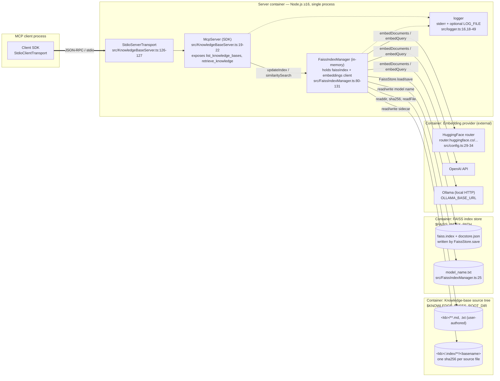

# C4 — Container

Zooming one level in from [`c4-context.md`](./c4-context.md). The system is the server process plus two on-disk stores with **different lifecycles**. They are independent containers: the server can be restarted without touching either; either can be deleted or relocated independently of the other; `model_name.txt` links the two across restarts.

## Diagram

## Containers

| Container                           | Tech                              | Lifecycle                                                                 | Persistence        |
| ----------------------------------- | --------------------------------- | ------------------------------------------------------------------------- | ------------------ |
| Server process                      | Node.js ≥16, TypeScript strict    | Launched per MCP client session; SIGINT triggers graceful shutdown (`src/KnowledgeBaseServer.ts:27-30`). | None (pure in-memory aside from two stores below). |
| Knowledge-base source tree          | Plain files on local FS           | User-authored, long-lived. Server only reads content; writes `.index/` sidecars next to sources. | User's responsibility. |
| FAISS index store                   | `faiss.index` + pickled docstore + `model_name.txt` | Written incrementally by this server. Wiped + rebuilt when the model changes (`src/FaissIndexManager.ts:153-164`). | Survives restarts; safe to delete (will rebuild from source tree on next call). |
| Embedding provider                  | Remote HTTP or local HTTP daemon  | External; one per configured `EMBEDDING_PROVIDER` (`src/config.ts:12`).   | N/A.               |

## Why the two stores are separate containers

They **look** like one thing — both are directories on the user's disk — but they have different owners, different lifecycles, and different risk profiles:

- `$KNOWLEDGE_BASES_ROOT_DIR` is **owned by the user** (the user writes the markdown). The server only writes sidecars into `.index/` subdirs.
- `$FAISS_INDEX_PATH` is **owned by the server** (every file here is either written by `FaissStore.save()` or by `initialize()` itself, `src/FaissIndexManager.ts:181`). Users must not drop files into it from other sources — see [`threat-model.md`](./threat-model.md) on `pickleparser` deserialization.
- Deleting `$FAISS_INDEX_PATH` is a safe no-op: next `retrieve_knowledge` call rebuilds it from the source tree via the fallback path at `src/FaissIndexManager.ts:302-346`.
- Deleting `$KNOWLEDGE_BASES_ROOT_DIR` makes queries return `_No similar results found._` on the next call (and the scan at `src/FaissIndexManager.ts:209` will find no KBs).

## Cross-container links

| Link                                             | Direction | Anchored at                                                          |
| ------------------------------------------------ | --------- | -------------------------------------------------------------------- |
| `KNOWLEDGE_BASES_ROOT_DIR` → per-file sha256 sidecar inside `.index/` | write     | `src/FaissIndexManager.ts:230-231, :362-377`                         |
| `FAISS_INDEX_PATH/model_name.txt` → model guard  | read/write | `src/FaissIndexManager.ts:143-164, :181`                             |
| `FAISS_INDEX_PATH/faiss.index` → in-memory `faissIndex` | load/save | `src/FaissIndexManager.ts:166-177, :348-355`                         |

## Out of scope

- How requests are routed *inside* the server process — see [`c4-component.md`](./c4-component.md).
- Retrieval vs indexing sequences — see [`sequence-retrieve.md`](./sequence-retrieve.md) and [`sequence-reindex.md`](./sequence-reindex.md).
