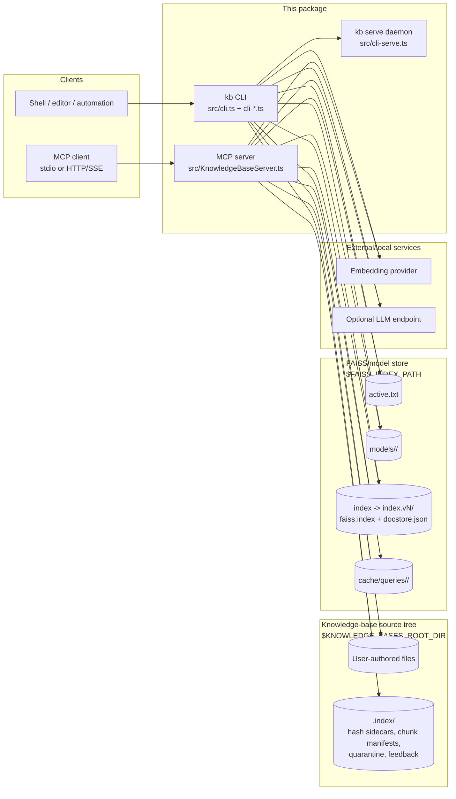

# C4 - Container

Zooming one level in from [`c4-context.md`](./c4-context.md). The current system
has two executable containers in this package (`build/index.js` and
`build/cli.js`) plus persistent stores under the KB root and FAISS root. The MCP
server and CLI share the same model registry and index layout.

## Diagram

## Containers

| Container | Tech | Lifecycle | Persistence |
| --- | --- | --- | --- |
| MCP server | Node.js >=20, TypeScript output | Launched by an MCP client over stdio, or by an operator/supervisor for HTTP/SSE mode. | In-memory managers only; durable state is in the stores below. |
| `kb` CLI | Node.js command binary | Fresh process per command, except when a command opts into `kb serve` for warm reads. | Writes only through explicit write commands or refresh/reindex flows. |
| `kb serve` daemon | Loopback HTTP helper | Foreground process or user service; optional. | Keeps warm in-memory state; durable state remains in the stores. |
| Knowledge-base source tree | Plain files | User-owned, long-lived content. | Source files plus `.index/` sidecars. |
| Search-index/model store | `active.txt`, `models/<id>/`, versioned search-index dirs, cache | Server-owned local state; safe to delete when the operator wants a rebuild. | Active model, model metadata, FAISS/HNSW index versions, query-vector and query-decomposition caches, update summaries. |
| Embedding provider | Local or remote HTTP/client library | External service selected by provider/model config. | N/A. |
| Optional LLM endpoint | OpenAI-compatible chat endpoint | External or `kb llm` managed profile. | Profile config/state is outside the FAISS store; see the data model. |

## Why The Stores Are Separate

- `$KNOWLEDGE_BASES_ROOT_DIR` is owned by the user. It contains durable notes and
  per-KB operational sidecars.
- `$FAISS_INDEX_PATH` is owned by the server. It contains derived indexes,
  model-selection state, query cache entries, and persisted diagnostics.
- Deleting `$FAISS_INDEX_PATH` removes derived retrieval state only; the next
  refresh/rebuild can reconstruct vectors from the source tree.
- Deleting a KB source directory removes user content and cannot be reconstructed
  from FAISS.

## Cross-Container Links

| Link | Direction | Source of truth |
| --- | --- | --- |
| Active model selection | CLI/MCP read `active.txt`; model commands write it. | `src/active-model.ts` |
| Per-model FAISS persistence | Managers load/save versioned `models/<id>/index.vN/` directories. | `src/faiss-store-layout.ts`, `src/FaissIndexManager.ts` |
| Source freshness | Refresh compares source hashes with `<kb>/.index/` sidecars and chunk manifests. | `src/file-ingest.ts`, `src/FaissIndexManager.ts` |
| Query cache | Retrieval can reuse query embeddings from memory or `$FAISS_INDEX_PATH/cache/queries/`. | `src/query-cache.ts` |
| Remote MCP runtime stats | HTTP/SSE hosts expose counters to `kb_stats` while active. | `src/transport-runtime-stats.ts`, `src/KnowledgeBaseServer.ts` |

## Out Of Scope

- Request-level sequences; see [`sequence-retrieve.md`](./sequence-retrieve.md).
- Forced rebuild and model selection flows; see [`sequence-reindex.md`](./sequence-reindex.md).
- Security posture; see [`threat-model.md`](./threat-model.md).
