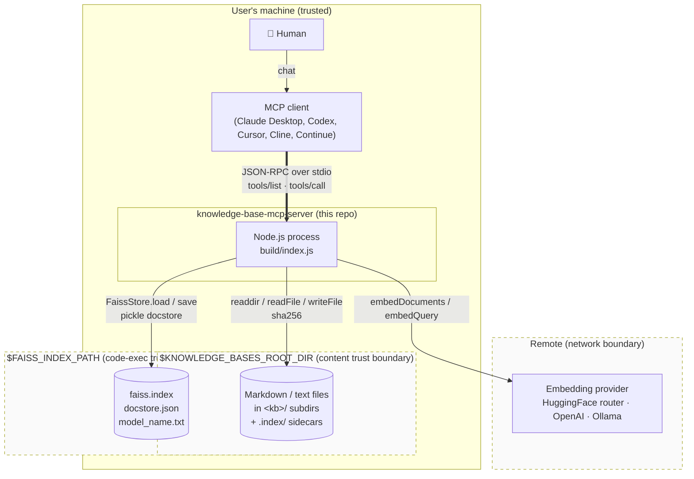

# C4 — Context

The server is a single-process, stdio-attached MCP server. One human talks to one MCP client; the client launches one server process per configured knowledge-base root; that process reaches out to one embedding provider and persists to one on-disk FAISS index.

## Diagram

## Participants

| Actor                         | Role                                                                    | Where it's anchored                                                 |
| ----------------------------- | ----------------------------------------------------------------------- | ------------------------------------------------------------------- |
| Human                         | Types natural-language queries into an MCP client.                      | Out of process.                                                     |
| MCP client                    | Spawns `build/index.js`, connects to its stdio, calls `tools/list` + `tools/call`. | Any SDK-compliant client; our server registers in `src/KnowledgeBaseServer.ts:19-22`. |
| Server process                | The Node.js process built from `src/`.                                  | Entry point `src/index.ts:5-11`; transport hook-up `src/KnowledgeBaseServer.ts:126-127`. |
| Embedding provider            | External HTTP service that turns text into vectors.                     | Provider picked in `src/FaissIndexManager.ts:86-131`; routed URL for HF is `src/config.ts:29-34`. |
| `$KNOWLEDGE_BASES_ROOT_DIR`   | Local directory the user populates with markdown/text.                  | Default at `src/config.ts:5-6`.                                     |
| `$FAISS_INDEX_PATH`           | Local directory holding the FAISS index + docstore + `model_name.txt`. | Default at `src/config.ts:8-9`; files listed in [`data-model.md`](./data-model.md). |

## Trust boundaries

Three dashed boxes in the diagram, three distinct trust stories:

1. **`$KNOWLEDGE_BASES_ROOT_DIR` (content boundary).** File contents are embedded and returned verbatim to the MCP client. If this directory contains attacker-written prose, the result is prompt-injection against downstream agents — not code execution against the server. See [`threat-model.md`](./threat-model.md).
2. **`$FAISS_INDEX_PATH` (code-exec boundary).** `FaissStore.load()` deserializes the docstore via `pickleparser` (`package.json:27`, load site `src/FaissIndexManager.ts:169`). Loading an attacker-controlled index directory is arbitrary-code-execution-shaped. **Only files written by this server belong here.**
3. **Network boundary to the embedding provider.** Query text and knowledge-base content leave the machine in cleartext over TLS to whichever provider is configured. Provider keys (`HUGGINGFACE_API_KEY`, `OPENAI_API_KEY`, `OLLAMA_BASE_URL`) are read from env and never logged as payload.

## What is *not* in this view

- Process-to-process concurrency (there is none — see [`threat-model.md`](./threat-model.md) concurrency section; constraint is one process per `$FAISS_INDEX_PATH`).
- Remote MCP transport (not implemented today; see RFC 008 for the proposal).
- Access control (none; stdio clients inherit the user's permissions).
