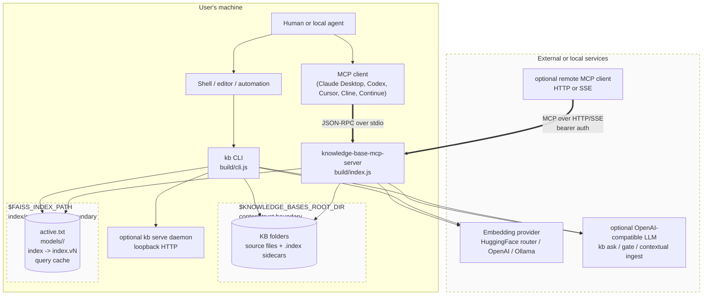

# C4 - Context

The server is a local-first knowledge retrieval process plus a companion `kb`
CLI. A human or agent can reach it through an MCP client, through optional
HTTP/SSE MCP transport, or directly through the CLI. All modes share the same
knowledge-base source tree, embedding-provider configuration, and per-model
FAISS index layout.

## Diagram

## Participants

| Actor | Role | Where it is anchored |
| --- | --- | --- |
| Human or local agent | Issues queries, asks questions, writes notes, and runs diagnostics. | Out of process. |
| MCP client | Launches stdio server or connects to opt-in HTTP/SSE transport. | `src/KnowledgeBaseServer.ts` transport startup and tool registration. |
| `kb` CLI | Shell-friendly search, ask, model, diagnostics, eval, research, feedback, and write workflows. | `src/cli.ts` dispatcher and `src/cli-*.ts` command modules. |
| Optional `kb serve` daemon | Keeps warm CLI read paths available over loopback HTTP. | `src/cli-serve.ts` and `src/daemon-client.ts`. |
| Server process | Registers MCP tools/resources and coordinates model managers, retrieval, writes, and transport hosts. | `src/KnowledgeBaseServer.ts`. |
| Embedding provider | Converts source chunks and queries into vectors. | `src/embedding-provider.ts`. |
| Optional LLM endpoint | Answers `kb ask`, relevance-gate judge calls, and contextual ingest prefaces when enabled. | `src/llm-client.ts`, `src/ask-core.ts`, `src/contextual-preface.ts`. |
| `$KNOWLEDGE_BASES_ROOT_DIR` | User-owned source tree plus per-KB `.index/` sidecars. | `src/config/paths.ts`, `src/kb-fs.ts`, `src/file-ingest.ts`. |
| `$FAISS_INDEX_PATH` | Server-owned model registry, versioned FAISS stores, cache, and index metadata. | `src/active-model.ts`, `src/faiss-store-layout.ts`, `src/query-cache.ts`. |

## Trust Boundaries

1. **`$KNOWLEDGE_BASES_ROOT_DIR` is a content boundary.** Retrieved text is
   untrusted input for downstream agents. Injection guards can tag or wrap
   suspicious content, but they do not make retrieved text trustworthy.
2. **`$FAISS_INDEX_PATH` is an index/code-execution boundary.** FAISS docstore
   loading goes through LangChain/FAISS serialization, so only this server should
   write those files.
3. **Embedding and LLM providers are network/data boundaries.** Query text and
   source chunks can leave the machine unless the operator uses local providers.
4. **HTTP/SSE MCP transport is optional and authenticated.** Non-stdio transport
   requires a bearer token, denies browser origins unless explicitly allowed,
   and binds to loopback by default.

## What Is Not In This View

- Internal module relationships; see [`c4-component.md`](./c4-component.md).
- Detailed index state transitions; see [`state-index.md`](./state-index.md).
- Full security analysis; see [`threat-model.md`](./threat-model.md).
