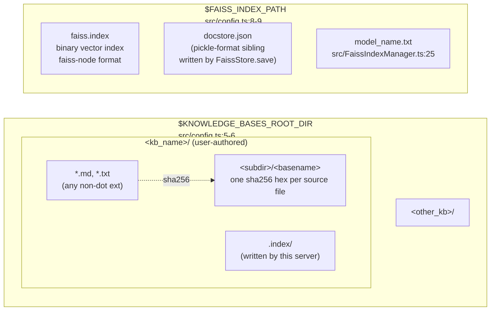

# Data model

Every artifact that survives a process restart lives in one of two directories. This page enumerates the files and the schema of what's inside them.

## On-disk layout



The two trees are independent (see [`c4-container.md`](./c4-container.md) for lifecycle notes). Sidecars travel with the source file, not with the vector index — so a user can safely `rm -rf $FAISS_INDEX_PATH/` to force a full rebuild without invalidating the sidecar sha tree, and moving a KB between roots doesn't orphan vectors of unrelated KBs.

## Artifacts

### Per-file hash sidecar

Written by `src/FaissIndexManager.ts:362-377`. One text file per indexed source file; content is a lowercase sha256 hex digest of the source bytes.

| Field   | Type                     | Source                                      |
| ------- | ------------------------ | ------------------------------------------- |
| path    | `<kb>/.index/<rel_dir>/<basename>` | derived at `src/FaissIndexManager.ts:230-231` |
| content | sha256 hex string (64 chars) | `calculateSHA256` at `src/utils.ts:6-11`     |
| atomicity | tmp+rename              | `src/FaissIndexManager.ts:363-374`          |

The path structure mirrors the source tree under `<kb>/` — so a file at `<kb>/a/b/c.md` gets a sidecar at `<kb>/.index/a/b/c.md`. ADR [`0002-per-file-hash-sidecars.md`](./adr/0002-per-file-hash-sidecars.md) covers why this layout was chosen over a single `hashes.json` manifest.

### `faiss.index`

The binary vector index in `faiss-node`'s native format. Produced by `FaissStore.save(path)` (`src/FaissIndexManager.ts:351`), loaded by `FaissStore.load(path, embeddings)` (`src/FaissIndexManager.ts:169`). Endianness and float layout are platform-dependent; a fixture built on one arch may not load on another.

### Docstore sibling

`FaissStore.save` emits a JSON-serialized docstore alongside `faiss.index` (written to the same directory). The serialization path uses `pickleparser@0.2.1` (`package.json:27`) for cross-language compatibility with Python LangChain on load. This is the **code-exec trust boundary** — loading an attacker-controlled file here is arbitrary-code-execution-shaped; see [`threat-model.md`](./threat-model.md).

### `model_name.txt`

Single-line text file containing the current configured embedding model name. Written once per `initialize()` at `src/FaissIndexManager.ts:181`. Compared to `this.modelName` on the next startup at `:153`. If they differ, `faiss.index` is unlinked and the next `updateIndex` rebuilds — see [`sequence-reindex.md`](./sequence-reindex.md) and ADR [`0005-auto-rebuild-on-model-change.md`](./adr/0005-auto-rebuild-on-model-change.md).

## In-memory: chunk metadata schema

Documents are created at two call sites with identical schemas:

- Changed-file branch (`src/FaissIndexManager.ts:261-275`): either split by `MarkdownTextSplitter` (`.md`) or wrapped as a single `Document` (everything else).
- Fallback branch (`src/FaissIndexManager.ts:317-332`): same logic re-applied during a full rebuild.

### Current schema (today)

```ts
type ChunkMetadata = {
  source: string;   // absolute path to the originating file on disk
};
```

**That's the whole schema.** The only field set by this server is `source`. It's consumed by:

- `handleRetrieveKnowledge` (`src/KnowledgeBaseServer.ts:98-100`), which serializes `metadata` as pretty-printed JSON in the tool response.
- Any downstream consumer that wants to dedup, group, or filter by source file — today, none inside this repo.

### Forthcoming (per RFC 006 M1.3)

The multi-provider tiered-retrieval RFC plans to extend the schema with:

| Field           | Type                       | Purpose                                                         |
| --------------- | -------------------------- | --------------------------------------------------------------- |
| `tags`          | `string[]`                 | Allow-list / deny-list filtering at query time.                 |
| `chunkIndex`    | `number`                   | Ordinal within the source file, for reconstructing context.     |
| `knowledgeBase` | `string`                   | Cheap KB-scope filter without string-matching `source`.         |

RFC 006 specifies this; it is **not** live in the current code. When it lands, this section flips from "forthcoming" to "current" in the same PR.

## Not persisted

- Query text is **not** logged or stored anywhere; it flows straight to `embedQuery` (`src/FaissIndexManager.ts:402`) and is gone when the request returns.
- Embedding provider keys (`HUGGINGFACE_API_KEY`, `OPENAI_API_KEY`) are held in `process.env` for the life of the process. They are not written to sidecars, `model_name.txt`, or any log payload.
- There is no cache / queue / scratch dir outside the two trees above.
