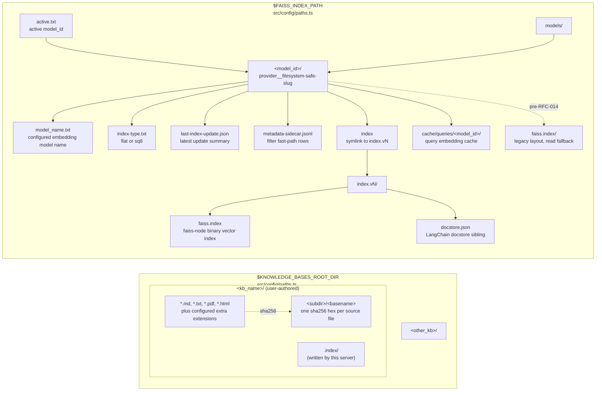

# Data model

Every artifact that survives a process restart lives under either `$KNOWLEDGE_BASES_ROOT_DIR` or `$FAISS_INDEX_PATH`. This page is a current snapshot; if a claim here stops matching the cited source file, the doc is stale.

## On-disk layout



The two trees are independent (see [`c4-container.md`](./c4-container.md) for lifecycle notes). Hash sidecars travel with the source file, not with the vector index. Deleting `$FAISS_INDEX_PATH/` removes vectors but not source files; startup/update code treats the missing FAISS store as a rebuild signal and may purge stale sidecars before re-embedding. Moving a KB between roots does not orphan vectors for unrelated KBs.

## Artifacts

### Per-file hash sidecar

Written after a successful FAISS save by `writeSidecarHashes` (`src/file-ingest.ts:118-144`), called from `FaissIndexManager.updateIndex` (`src/FaissIndexManager.ts:782-793`). One text file exists per indexed source file; content is a lowercase sha256 hex digest of the source bytes.

| Field | Type | Source |
| --- | --- | --- |
| path | `<kb>/.index/<rel_dir>/<basename>` | derived from `relativePath` at `src/FaissIndexManager.ts:647-659` |
| content | sha256 hex string (64 chars) | `calculateSHA256` at `src/FaissIndexManager.ts:648-650` |
| atomicity | tmp+rename under the sidecar lock | `src/file-ingest.ts:122-132` |

The path structure mirrors the source tree under `<kb>/`: a file at `<kb>/a/b/c.md` gets a sidecar at `<kb>/.index/a/b/c.md`. ADR [`0002-per-file-hash-sidecars.md`](./adr/0002-per-file-hash-sidecars.md) covers why this layout was chosen over a single `hashes.json` manifest.

### Pending sidecar commit manifest

`pending-manifest.json` lives in `models/<model_id>/` while an index-mutating `updateIndex` is between FAISS persistence and sidecar persistence. It records the hash sidecars and chunk manifests that must be written for the saved vectors to be considered committed.

| Field | Type | Meaning |
| --- | --- | --- |
| `schema_version` | `kb.pending-sidecar-commit.v1` | Parser guard. |
| `phase` | `save-started` or `save-complete` | Whether the FAISS save has been confirmed. |
| `pending_hash_writes` | array of `{path, hash}` | Absolute hash sidecar paths plus source sha256. |
| `pending_chunk_manifest_writes` | array of `{path, manifest}` | Absolute chunk-manifest sidecar paths plus manifest JSON. |

Normal completion removes the manifest after all sidecars are durable. On startup, `save-complete` rolls forward by writing the sidecars and removing the manifest. `save-started` is intentionally conservative: recovery purges the persisted store and stale sidecars so the next update rebuilds instead of risking duplicate vectors or hashes for missing vectors.

### Model registry

`$FAISS_INDEX_PATH/active.txt` records the active `model_id`; callers can override it with `KB_ACTIVE_MODEL` (`src/active-model.ts:5`, `:26`). Each registered model lives at `$FAISS_INDEX_PATH/models/<model_id>/`, where `<model_id>` is derived from provider and model name (`README.md:102`, `src/active-model.ts:37-43`).

A model is registered only when its directory exists, `model_name.txt` exists, and `.adding` does not exist (`src/active-model.ts:107-127`). `model_name.txt` is written per model during `FaissIndexManager.initialize()` (`src/FaissIndexManager.ts:327-334`) and stores the configured embedding model name, not the derived model id.

### Versioned FAISS store

New saves use the RFC 014 layout in each model directory:

```text
models/<model_id>/
  model_name.txt
  index -> index.vN
  index.vN/
    faiss.index
    docstore.json
  index.vN-1/
    faiss.index
    docstore.json
```

`saveFaissStoreAtomic` writes the next `index.vN/`, creates a temporary symlink, atomically renames it to `index`, and then prunes inactive version directories (`src/faiss-store-layout.ts`). The default retention policy keeps the active version plus two inactive retained versions. Operators can set `KB_INDEX_VERSION_RETENTION=<non-negative integer>` to change the inactive-version count; `0` keeps only the active version after a successful save. Pruning reads the active `index` symlink before deleting anything and never removes that target, even if it is outside the newest retained versions. `kb doctor` reports active, inactive, and total version-directory storage so retained-version cost is visible during health checks.

`loadFaissStoreAtomic` pins reads by resolving the `index` symlink once before calling `FaissStore.load`, so `faiss.index` and `docstore.json` come from the same version directory even if another writer swaps the symlink later (`src/faiss-store-layout.ts:58-120`).

`faiss.index` is the binary vector index in `faiss-node`'s native format. `docstore.json` is the LangChain docstore sibling emitted by `FaissStore.save`; it is part of the `$FAISS_INDEX_PATH` code-exec trust boundary because loading attacker-controlled serialized data is unsafe. See [`threat-model.md`](./threat-model.md).

### Legacy FAISS store

The pre-RFC-014 layout is `models/<model_id>/faiss.index/{faiss.index,docstore.json}`. The loader still falls back to it when the `index` symlink is absent (`src/faiss-store-layout.ts:122-142`). The first successful save under the new layout writes `index.vN/` and leaves the legacy directory untouched as downgrade/rollback slack (`src/FaissIndexManager.ts:765-770`). When both layouts are present, `kb models list` can surface a downgrade hazard derived directly from filesystem state (`src/active-model.ts:129-185`).

### Query embedding cache

`$FAISS_INDEX_PATH/cache/queries/<model_id>/` stores optional query-vector cache
entries. Each query key is a SHA-256 over schema version, `model_id`, and the
normalized query. The vector is stored as `<sha>.f32`; metadata is stored as
`<sha>.meta.json`. The cache is a latency/cost optimization only: corrupt or
incomplete entries are removed and treated as misses. Operators can disable it
with `KB_QUERY_CACHE=off` or per-call CLI flags where supported.

### Model sidecar files

Each model directory can also contain:

- `index-type.txt` — index creation type such as `flat` or `sq8`.
- `last-index-update.json` — latest sanitized `updateIndex` summary for fresh
  process stats and doctor reports.
- `metadata-sidecar.jsonl` — per-doc metadata rows used to speed filtered search
  before falling back to post-filter overfetch.
- `pending-manifest.json` — crash-recovery manifest between FAISS save and
  sidecar commit.
- `.adding` — temporary sentinel while `kb models add` is in progress.

### Other durable operator artifacts

Not every durable artifact belongs under the two retrieval stores:

- `kb research collect --run-dir=<path>` writes `run.json`, `plan.json`,
  `ledger.json`, `events.jsonl`, and `evidence_packet.md` to the operator-chosen
  run directory.
- `KB_MUTATION_AUDIT_LOG=<path>` writes an append-only mutation audit JSONL file
  outside the KB and FAISS roots when configured.
- `kb llm` profile and managed-service state live under configurable user config,
  state, and systemd directories (`KB_LLM_CONFIG_DIR`, `KB_LLM_STATE_DIR`,
  `KB_LLM_SYSTEMD_USER_DIR`).

## In-memory: chunk metadata schema

`FaissIndexManager.updateIndex` uses one chunk builder for changed-file indexing and full-rebuild fallback (`src/FaissIndexManager.ts:705-709`, `:748-752`). `buildChunkDocuments` splits markdown with `MarkdownTextSplitter`, other ingested extensions with `RecursiveCharacterTextSplitter`, strips YAML frontmatter from page content, and attaches the metadata below to every emitted `Document` (`src/file-ingest.ts:37-104`).

```ts
type ChunkMetadata = {
  source: string;
  relativePath: string;
  knowledgeBase: string;
  extension: string;
  chunkIndex: number;
  tags: string[];
  frontmatter?: LiftedFrontmatter;
  pdf_path?: string;
};
```

### Chunk metadata fields

| Field | Type | Always present? | Source of truth | Wire exposure |
| --- | --- | --- | --- | --- |
| `source` | `string` absolute path | yes | `src/file-ingest.ts:87-95` | visible |
| `relativePath` | `string` POSIX path relative to `$KNOWLEDGE_BASES_ROOT_DIR` | yes | `src/file-ingest.ts:68-72` | visible; used by path filters |
| `knowledgeBase` | `string` KB directory name | yes | `buildChunkDocuments(..., knowledgeBaseName)` at `src/file-ingest.ts:50-54`, `:92-97` | visible |
| `extension` | `string` lowercase extension, including dot | yes | `path.extname(filePath).toLowerCase()` at `src/file-ingest.ts:55`, `:92-98` | visible |
| `chunkIndex` | `number` zero-based ordinal within the source file | yes | loop index at `src/file-ingest.ts:91-99` | visible; formatter uses it as fallback location |
| `tags` | `string[]` | yes | `parseFrontmatter(content)` at `src/file-ingest.ts:68`, `:92-100` | visible |
| `frontmatter` | `LiftedFrontmatter` | no | `liftFrontmatter(frontmatter, filePath)` at `src/file-ingest.ts:74-100` | visible after sanitization; `extras` hidden by default |
| `pdf_path` | `string` KB-relative POSIX path | no | `detectSiblingPdfPath` for markdown files at `src/file-ingest.ts:80-101` | visible |

### Lifted frontmatter

`liftFrontmatter` is the whitelist for `metadata.frontmatter` (`src/frontmatter-lift.ts:19-56`). String fields are `arxiv_id`, `title`, `authors`, `published`, `ingested_at`, `judge_method`, `metrics_used`, `bias_handling`, `status`, `review_status`, `promote_model`, `tier`, and `last_verified_at`. Typed fields are `relevance_score?: number`, `confidence?: number`, `manual_edits?: boolean`, and `contradicted_by?: string[]`.

Unknown string-valued YAML keys are collected into `frontmatter.extras`; non-string generic keys are dropped with debug logging (`src/frontmatter-lift.ts:131-154`). `sanitizeMetadataForWire` strips `frontmatter.extras` unless `FRONTMATTER_EXTRAS_WIRE_VISIBLE=true` (`src/formatter.ts:34-58`). The stored FAISS docstore keeps the original metadata object; the sanitizer applies at markdown and JSON response formatting time (`src/formatter.ts:66-90`, `:123-140`).

### Sibling PDF path

For markdown chunks only, `detectSiblingPdfPath` looks for a same-stem PDF in the arxiv layout (`<kb>/pdfs/<stem>.pdf`) and then in the same directory as the markdown file. It returns a KB-relative forward-slash path and rejects paths that escape the KB root (`src/frontmatter-lift.ts:189-218`).

## Not persisted

- Raw query text is not written to disk by the retrieval path. Query-cache keys
  are hashes of normalized query text, model id, and schema version; cache values
  are vectors, not raw queries.
- Embedding provider keys (`HUGGINGFACE_API_KEY`, `OPENAI_API_KEY`) are held in `process.env` for the life of the process. They are not written to sidecars, model registry files, or FAISS docstore metadata.
- Retrieval itself has no queue. Operator workflows such as `kb research`,
  mutation audit logging, and `kb llm` profiles write outside the retrieval
  stores only when the operator selects or enables those surfaces.

## Checked against

This page is verified against the following source files. If one of these files moves or its cited lines drift, refresh this doc rather than letting the claim go stale.

- Chunk metadata wire shape: `src/file-ingest.ts:37-104`.
- Frontmatter whitelist + sanitisation: `src/frontmatter-lift.ts:19-218`, `src/formatter.ts:34-90`.
- Atomic FAISS save / pinned load / version retention: `src/faiss-store-layout.ts`.
- Query embedding cache: `src/query-cache.ts`.
- Model registry, model sidecars, incomplete-add sentinel: `src/active-model.ts`.
- Sidecar write path: `src/file-ingest.ts:118-144`, `src/FaissIndexManager.ts:782-793`.
- Active-model resolution: `src/active-model.ts:5-26`, `:259-330`.
- Per-model directory and `model_name.txt`: `src/active-model.ts:107-127`, `src/FaissIndexManager.ts:327-334`.
