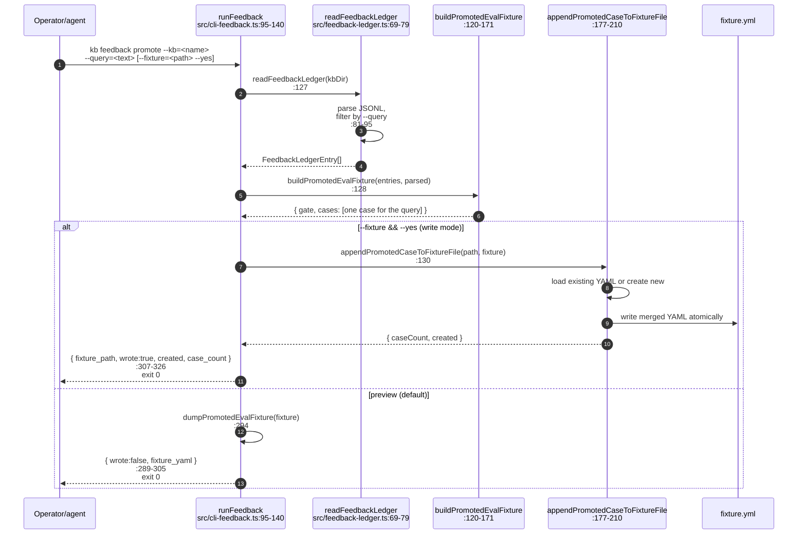

# Sequence — `kb feedback` (add + promote)

`kb feedback` has three actions; this diagram covers the two that mutate
state. `list` is a trivial read of the JSONL ledger and is not diagrammed
separately.

The CLI entrypoint is `runFeedback` at `src/cli-feedback.ts:95-140`, which
dispatches to `appendFeedbackEntry` (add) or
`buildPromotedEvalFixture` + `appendPromotedCaseToFixtureFile` (promote).

## Add a judgment

```mermaid
sequenceDiagram
  autonumber
  participant Op as Operator/agent
  participant Cli as runFeedback<br/>src/cli-feedback.ts:95-140
  participant Ledger as appendFeedbackEntry<br/>src/feedback-ledger.ts:61-67
  participant KbFs as resolveKnowledgeBaseDir<br/>src/kb-fs.ts
  participant FS as &lt;kb&gt;/.index/relevance-feedback.jsonl

  Op->>Cli: kb feedback add --kb=<name> --query=<text><br/>--source=<rel-path> [verdict flags]
  Cli->>KbFs: resolveKnowledgeBaseDir(KB_ROOT, kb)<br/>:106
  KbFs-->>Cli: <kb> absolute path
  Note over Cli: parseFeedbackArgs validates required fields<br/>:142-166
  Cli->>Ledger: appendFeedbackEntry(kbDir, input)<br/>:114
  Ledger->>Ledger: buildFeedbackEntry → ULID id,<br/>created_at, SHA-256 of task_context<br/>:97-118
  Ledger->>FS: fsp.appendFile JSONL line
  FS-->>Ledger: ok
  Ledger-->>Cli: FeedbackLedgerEntry
  Cli-->>Op: { ledger_path, entry } (JSON)<br/>:253-269<br/>exit 0
```

Stable guarantees:

- The ledger file is append-only. If a prior process held it open with a
  pending write, the new line still appends cleanly thanks to POSIX
  `O_APPEND` semantics.
- `task_context_sha256` is computed at `buildFeedbackEntry` time; raw task
  context never reaches disk.
- `verdict` and `relevance` defaults are applied in `buildFeedbackEntry`,
  not in the CLI parser — direct programmatic callers get the same defaults
  as the CLI.

## Promote into an eval fixture



## Key invariants

- **Preview by default.** Without both `--fixture` and `--yes`, no file is
  touched. The `wrote: false` envelope carries the rendered YAML so the
  operator can review.
- **One case per promotion.** Each `promote` call emits exactly one `kb eval`
  case for the target query (the case includes every ledger row that
  matches). Re-running promotion appends another case rather than mutating
  the previous one, so fixture history is monotonic.
- **Idempotency boundary.** Adding the same judgment twice via `kb feedback
  add` produces two ledger rows (different ULIDs). Operator-driven
  retraction is by hand-editing the JSONL file — there is no `remove`.

## Related

- Operator walk-through: [`docs/operations/feedback-workflow.md`](../operations/feedback-workflow.md)
- JSON contract: [`docs/cli-json-contracts.md`](../cli-json-contracts.md#kb-feedback)
- Upstream: `kb research` (this diagram's sibling) produces the candidate
  evidence operators typically judge — see
  [`sequence-research-collect.md`](sequence-research-collect.md).
- Downstream: the promoted fixture is consumed by `kb eval`
  (`docs/cli-json-contracts.md#kb-eval`).
