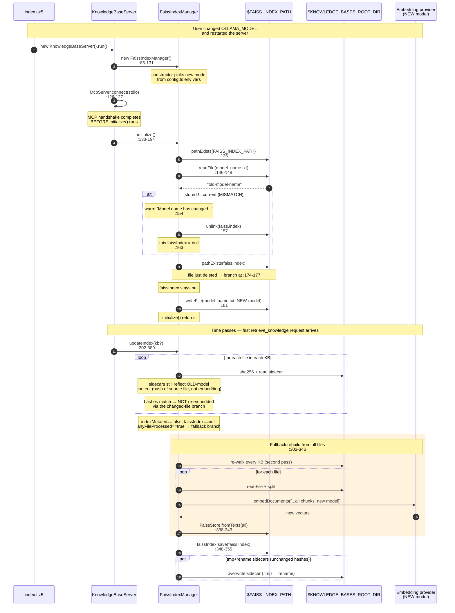

# Sequence — model-change reindex

What happens when the user changes `EMBEDDING_PROVIDER`, `HUGGINGFACE_MODEL_NAME`, `OLLAMA_MODEL`, or `OPENAI_MODEL_NAME` with an existing index on disk. The triggering comparison is at `src/FaissIndexManager.ts:153`; the teardown at `:154-164`; the reconstruction at `src/FaissIndexManager.ts:302-346` on the next `updateIndex` call.

This is a **destructive** path — the old `faiss.index` is deleted, then rebuilt from source markdown using the new model. ADR [`0005-auto-rebuild-on-model-change.md`](./adr/0005-auto-rebuild-on-model-change.md) explains why the current code wipes rather than refuses, and why that choice is debatable.

## Diagram

## Why the fallback runs

The sha256 sidecars are hashes of the **source file content**, not of the embedding — so changing the embedding model does **not** invalidate them (`src/utils.ts:6-11`). On the first call after a model change:

- Every file's hash matches its sidecar, so the changed-file branch at `src/FaissIndexManager.ts:250-293` is skipped.
- But `this.faissIndex` is still `null` (cleared by the model-change block at `:163`, not replaced by the `FaissStore.load` branch at `:166-177` because `faiss.index` no longer exists).
- The combination — "some files scanned AND `faissIndex === null`" — triggers the fallback at `src/FaissIndexManager.ts:302-346`, which unconditionally re-embeds every file.

That fallback is also what recovers from a user manually deleting `$FAISS_INDEX_PATH/faiss.index`.

## Cost

Proportional to `total_chunks × per_chunk_embedding_latency` plus one `save()`. RFC 007 §5.2 measured 10 761 ms for 100 files / 500 chunks against a 20 ms/chunk stub; real providers range from 50 to 200 ms/chunk — see [`qa-budgets.md`](./qa-budgets.md).

## Partial-model switch (e.g. wrong provider env)

If the user sets `EMBEDDING_PROVIDER=openai` but forgets `OPENAI_API_KEY`, construction throws at `src/FaissIndexManager.ts:100` before `initialize()` runs — so the on-disk index is **not** touched. Same for HuggingFace at `:112`. The `.faiss/` directory survives, and reverting the env on the next start restores the prior behaviour with no rebuild cost.
