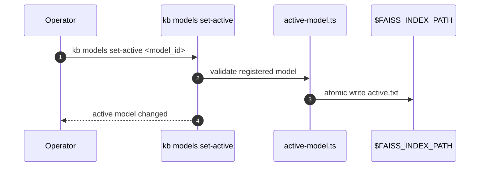
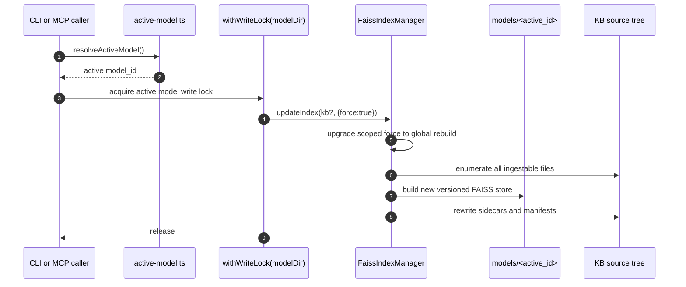

# Sequence - reindex and model selection

This page replaces the earlier "model-change wipes the index" description. The
current system uses RFC 013 multi-model layout: a provider/model pair maps to a
stable `model_id`, each model has its own directory, and changing the active
model selects a different directory instead of deleting the previous one.

## Model Add And Activation

```mermaid
sequenceDiagram
  autonumber
  participant Op as Operator
  participant Cli as kb models
  participant Active as active-model.ts
  participant FIM as FaissIndexManager
  participant Lock as withWriteLock(modelDir)
  participant Store as $FAISS_INDEX_PATH/models/<id>
  participant Provider as Embedding provider
  participant FS as KB source tree

  Op->>Cli: kb models add <provider> <model>
  Cli->>Active: derive model_id and create .adding sentinel
  Cli->>FIM: new FaissIndexManager({provider, modelName})
  Cli->>Lock: acquire lock for models/<id>
  Lock->>FIM: initialize()
  FIM->>Store: create model dir + model_name.txt + index-type.txt
  Lock->>FIM: updateIndex(undefined, force/build)
  FIM->>FS: enumerate, load, split files
  FIM->>Provider: embed chunks in bounded batches
  FIM->>Store: save index.vN and atomically swap index
  FIM->>FS: write hash/chunk sidecars
  Cli->>Active: remove .adding; optionally write active.txt
  Cli-->>Op: model registered
```

Activation is a small metadata write:



The previously active model directory remains on disk. Operators can switch back
without re-embedding unless they removed that model or its index.

## Forced Reindex

`kb reindex --with-context`, `kb search --refresh`, and MCP
`reindex_knowledge_base` all eventually call `FaissIndexManager.updateIndex`.
When `force` is true, the rebuild is global for the active model even if the
caller supplied a KB name. FAISS deletion is not supported in this server, so a
"scoped force rebuild" would either duplicate old vectors or drop other KBs.



## Recovery And Safety

- `.adding` sentinels hide incomplete model directories from `list_models` and
  let `kb models` report interrupted additions.
- Pending sidecar commit manifests recover crashes between FAISS persistence and
  sidecar persistence.
- Versioned saves write a new `index.vN/` directory and atomically swap the
  `index` symlink, so readers pin one coherent version.
- The old destructive model-switch path described by ADR 0005 is superseded by
  side-by-side model directories.
