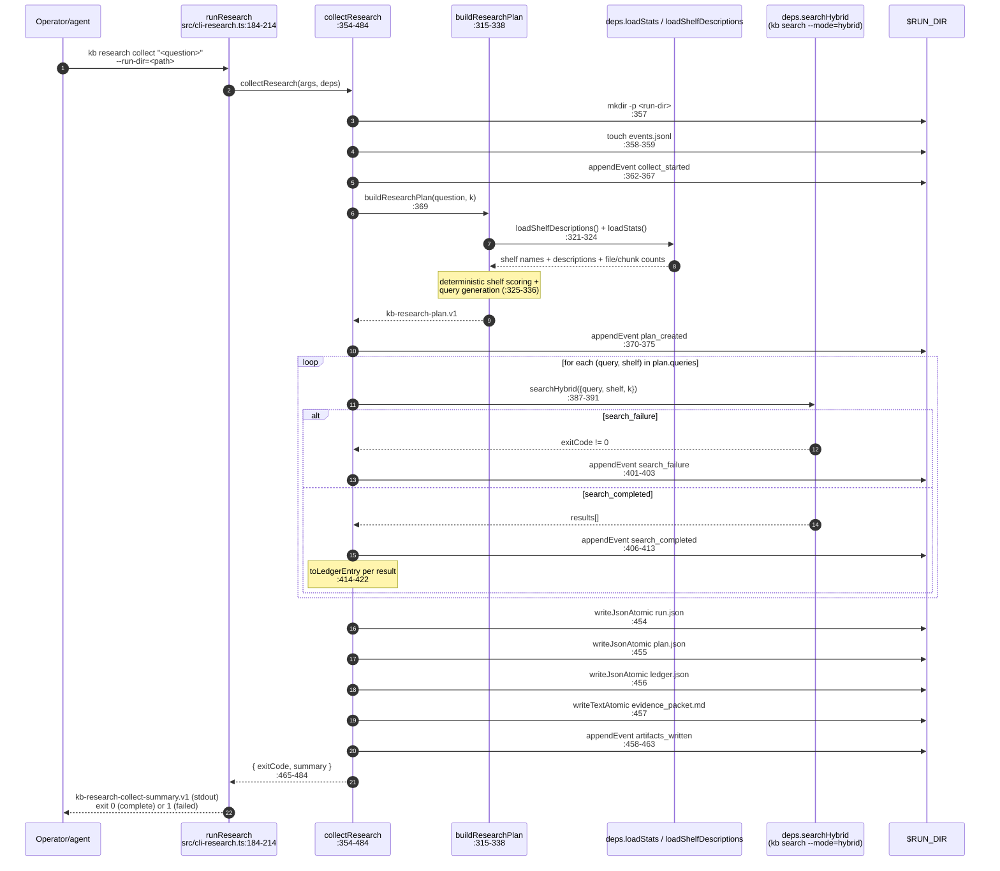

# Sequence — `kb research collect`

End-to-end flow for `kb research collect "<question>" --run-dir=<path>`. The
entrypoint is `runResearch` at `src/cli-research.ts:184-214`, which dispatches
to `collectResearch` at `src/cli-research.ts:354-484` when the action is
`collect`.

The collector is deterministic and stateless across invocations: it never
calls an LLM, never writes KB content, and uses the existing CLI hybrid
search through a `deps.searchHybrid` seam so testing can mock the retrieval
boundary.

## Key invariants

- **No LLM call.** `collectResearch` calls only `deps.loadShelfDescriptions`,
  `deps.loadStats`, and `deps.searchHybrid`. None of those touch a language
  model.
- **Atomic per-artifact writes.** `writeJsonAtomic` / `writeTextAtomic`
  (`src/cli-research.ts` near :454-457) write to a temp file then rename, so
  a SIGINT mid-collect leaves either the previous file or no file — never a
  truncated one.
- **Events.jsonl is the audit trail.** Every state change (`collect_started`,
  `plan_created`, `search_completed`, `search_failure`, `artifacts_written`)
  appends a line. Replay it to reconstruct exactly what the collector saw.
- **Status mirrors search outcomes.** `status: failed` (exit `1`) means at
  least one `searchHybrid` call returned a non-zero exit. The successful
  shelf entries are still in the ledger; this is *partial failure*, not
  data loss.

## Cost profile

For `Q` queries × `S` shelves with `k` results each: one cold hybrid search
per `(query, shelf)` cell when called without `--daemon`, plus the constant
overhead of the planner (two parallel `loadShelfDescriptions` + `loadStats`
calls). With `kb serve` running and `--daemon` propagated, every shelf
search is warm.

## Related

- Operator walk-through: [`docs/operations/research-workflow.md`](../operations/research-workflow.md)
- JSON contract: [`docs/cli-json-contracts.md`](../cli-json-contracts.md#kb-research)
- Downstream: ledger entries feed [`kb feedback`](../operations/feedback-workflow.md)
  when an operator judges them.
