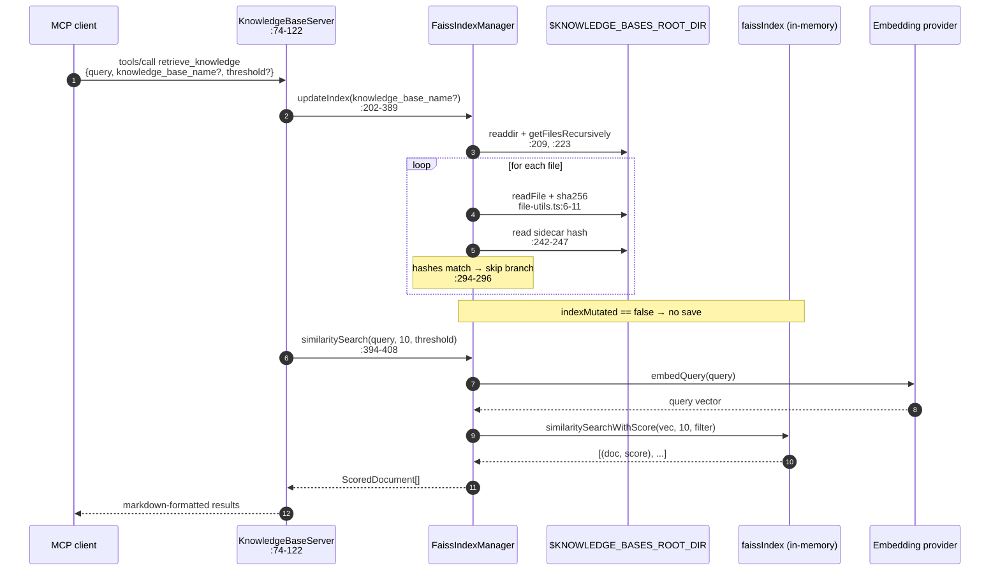
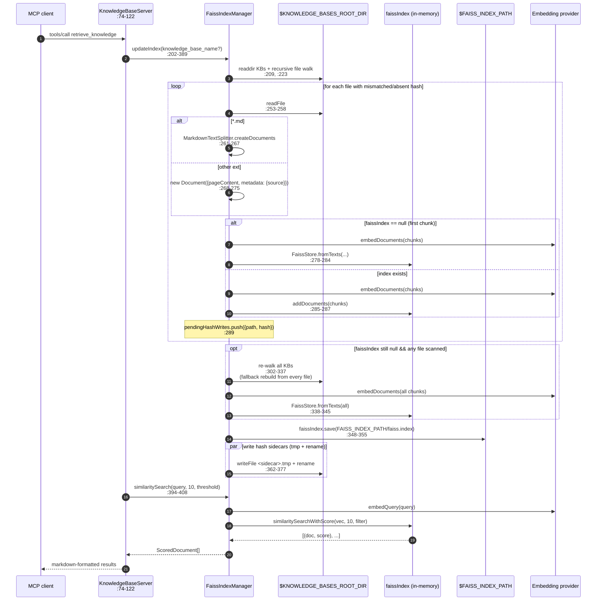

# Sequence — `retrieve_knowledge`

End-to-end flow for the `retrieve_knowledge` tool. The handler lives at `src/KnowledgeBaseServer.ts:74-122` and always runs two steps in order: refresh the index (`updateIndex` at `src/FaissIndexManager.ts:202-389`), then query it (`similaritySearch` at `src/FaissIndexManager.ts:394-408`).

There are two paths through the same handler, distinguished by **whether the in-memory `faissIndex` is already populated when the request arrives**. Both land at the same `similaritySearch` call.

## Warm path — index loaded, all hashes match

This is the cheap case: every file's on-disk sha matches the sidecar, so no embedding calls happen.

**Cost profile.** No embedding batches for documents, no FAISS save, no sidecar writes. The scan is O(files-across-selected-KBs) with one `stat` + `readFile` + sha256 + sidecar-read per file. See [`qa-budgets.md`](./qa-budgets.md) for the ~85 ms warm floor measured in RFC 007 §5.3.

## Cold path — no persisted index (or first-touch files)

Either `initialize()` found no `faiss.index` on disk (`src/FaissIndexManager.ts:174-177`), so `this.faissIndex` is `null` at request time, **or** some file hashes don't match. Both land in the same branch: changed chunks are embedded, `faissIndex` is built or extended, then persisted once.

### Ordering invariant

One `save()` per `updateIndex` call; hash sidecars are written **after** `save()` completes and use tmp+rename so each is atomic. If the process dies between `save()` and finishing sidecar writes, the un-sidecar'd files are re-embedded on the next call and their vectors are duplicated. RFC 007 §6.2.1 tracks the pending-manifest protocol that will close this gap; the current state is documented at `src/FaissIndexManager.ts:356-377` and in [`state-index.md`](./state-index.md) under **Recovering**.

### Fallback rebuild edge case

If the hash-scan phase embedded nothing (e.g. first call after a fresh restart with a `faiss.index` that failed to load, or an index-less directory that also has stale sidecar state) but files exist, the branch at `src/FaissIndexManager.ts:302-346` re-walks every KB and embeds **all** chunks unconditionally. This is the path that makes cold starts slow on large KBs — see [`qa-budgets.md`](./qa-budgets.md) for the 10 761 ms measurement at 100 files / 500 chunks.

## Error paths (not drawn)

- Permission error during save/sidecar → `handleFsOperationError` at `src/FaissIndexManager.ts:50-78` marks the error `__alreadyLogged` and rethrows. The tool handler catches it at `src/KnowledgeBaseServer.ts:114-121` and returns `{ isError: true }`.
- `similaritySearch` called when `faissIndex` is still `null` (e.g. empty `$KNOWLEDGE_BASES_ROOT_DIR`) → throws `"FAISS index is not initialized"` from `src/FaissIndexManager.ts:395-397`; the same handler converts it to `isError: true`.
- Provider call failure → unwound through the `throw error` at `src/FaissIndexManager.ts:380-388`; same handler path.
