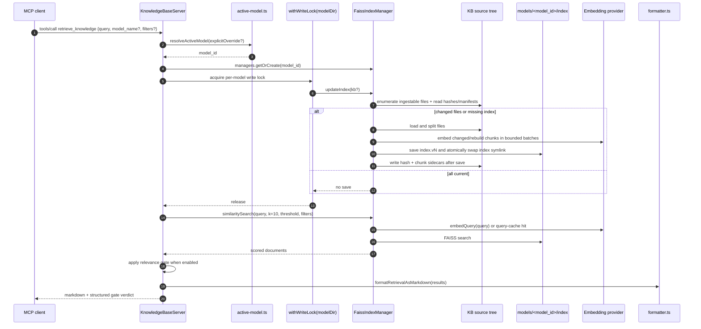

# Sequence - `retrieve_knowledge`

End-to-end flow for the MCP `retrieve_knowledge` tool. The handler resolves the
active or requested model, refreshes the selected model's index under a
per-model write lock, runs dense or hybrid retrieval, optionally applies the
relevance gate and reranker, and returns formatted markdown.

## Dense Path

## Hybrid Path

When `search_mode: "hybrid"` is passed, the server still refreshes the dense
index first. It then runs:

- a dense FAISS leg against the selected model;
- a lexical BM25 leg over the same KB scope;
- metadata filters (`extensions`, `path_glob`, `tags`, `since`, and `until`)
  applied to lexical candidates before fusion; the similarity threshold remains
  dense-only;
- Reciprocal Rank Fusion with `c=60`;
- optional cross-encoder reranking when enabled;
- the relevance gate when enabled.

Hybrid currently rejects neighbor-context expansion because context expansion is
implemented against dense semantic matches only.

## Key Invariants

- **Model resolution is per call.** `model_name` overrides the active model only
  for that request; otherwise `KB_ACTIVE_MODEL`, `active.txt`, then legacy env
  fallback are used.
- **Writes are per-model locked.** Refreshes for one model do not block reads or
  additions for another model unless they share the same model directory.
- **FAISS saves are versioned.** The active store is `models/<model_id>/index`,
  a symlink to an `index.vN/` directory containing `faiss.index` and
  `docstore.json`.
- **Sidecars are committed after FAISS.** Pending sidecar manifests make crashes
  between index save and sidecar write recoverable on the next initialize.
- **Default CLI search differs from MCP retrieval.** `kb search` is read-only
  unless `--refresh` is passed; MCP `retrieve_knowledge` preserves the historical
  refresh-before-query behavior.

## Error Paths

- Missing or corrupt active model resolution returns an MCP `isError` result.
- Provider, index, and validation failures are mapped to structured KB error
  payloads where possible.
- Relevance-gate or reranker provider failures degrade to the retrieval baseline
  unless the specific feature documents a stricter mode.
