# State — FAISS index lifecycle

Lifecycle of the in-memory `this.faissIndex: FaissStore | null` field and its on-disk counterpart under `$FAISS_INDEX_PATH/models/<model_id>/`. The diagram describes observable states from the caller's perspective: the field is either `null` or a loaded FAISS store; the lifecycle enriches that single bit with the reason for its current value.

## Diagram

```mermaid
stateDiagram-v2
  [*] --> None: process start<br/>before initialize()

  state "None" as None
  note left of None
    faissIndex = null
    model directory may or may not exist
    FaissIndexManager.initialize()
  end note

  None --> Loading: initialize() sees a versioned<br/>or legacy FAISS store on disk

  state "Loading" as Loading
  note right of Loading
    FaissStore.load(path, embeddings)
    loadFaissStoreAtomic()
    (may throw → handleFsOperationError)
  end note

  Loading --> Loaded: load() resolves
  Loading --> None: load() fails → re-thrown; next init retries

  None --> Rebuilding: force reindex or freshness manifest mismatch
  Loaded --> Rebuilding: force reindex or freshness manifest mismatch

  state "Rebuilding" as Rebuilding
  note right of Rebuilding
    faissIndex = null
    persisted index store removed
    updateIndex() embeds from current files
  end note

  Rebuilding --> None: persisted store purged

  None --> Loaded: updateIndex fallback rebuild
  None --> Loaded: first updateIndex call with changed files

  state "Loaded" as Loaded
  note left of Loaded
    faissIndex wraps a FaissStore
    models/<model_id>/index -> index.vN
    ready to answer similaritySearch
  end note

  Loaded --> Loaded: updateIndex with new / changed files<br/>add documents + atomicSave()
  Loaded --> Loaded: updateIndex with all-matching hashes<br/>(no-op save path)

  Loaded --> Recovering: initialize() sees pending-manifest.json<br/>phase=save-complete
  Recovering --> Loaded: finish pending sidecar writes
  Recovering --> None: phase=save-started<br/>purge persisted store + sidecars

  state "Recovering" as Recovering
  note right of Recovering
    pending-manifest.json records
    hash + chunk sidecars that
    must match the saved vectors
  end note

  Loaded --> [*]: SIGINT → McpServer.close()<br/>src/KnowledgeBaseServer.ts:27-30
```

## Transition triggers

| From → To                     | Trigger                                                                                   | Anchor                                             |
| ----------------------------- | ----------------------------------------------------------------------------------------- | -------------------------------------------------- |
| `[*]` → `None`                | Process start; constructor runs but does not load a FAISS store.                          | `FaissIndexManager.constructor`                    |
| `None` → `Loading`            | `initialize()` asks the atomic loader for the active versioned or legacy FAISS store.     | `FaissIndexManager.initialize`, `loadFaissStoreAtomic` |
| `Loading` → `Loaded`          | `FaissStore.load` resolves.                                                               | `loadFaissStoreAtomic`                             |
| `Loading` → `None`            | `FaissStore.load` rejects (permission / corrupt / incompatible). Error propagated or repaired to null depending on read-only mode. | `loadFaissStoreAtomic` |
| `None` → `Rebuilding`         | Forced reindex, freshness-manifest mismatch, or ambiguous pending sidecar commit requires a full rebuild. | `FaissIndexManager.updateIndex`, `recoverPendingSidecarCommit` |
| `Rebuilding` → `None`         | Persisted store and stale sidecars are purged; next `updateIndex` embeds from source files. | `purgePersistedIndexStore`, `purgeStaleSidecars` |
| `None` → `Loaded` (build)     | Changed-file branch creates the in-memory store from pending documents.                  | `addDocumentsToIndex`                              |
| `None` → `Loaded` (fallback)  | All hashes match but `faissIndex` was null → full rebuild from every file.                | `FaissIndexManager.updateIndex`                    |
| `Loaded` → `Loaded` (delta)   | Subsequent `updateIndex` with new/changed files; add documents and one atomic save.       | `addDocumentsToIndex`, `atomicSave`                |
| `Loaded` → `Recovering`       | `initialize()` detects a `save-complete` `pending-manifest.json` on disk.                | `src/FaissIndexManager.ts`, `src/pending-sidecar-commit.ts` |
| `Recovering` → `None`         | `initialize()` detects an ambiguous `save-started` manifest and purges persisted store + sidecars for a rebuild. | `src/FaissIndexManager.ts`, `src/pending-sidecar-commit.ts` |
| `Loaded` → `[*]`              | SIGINT handler closes the MCP server.                                                     | `src/KnowledgeBaseServer.ts:27-30`                 |

## Invariants

- **`model_name.txt` is written only in `initialize()`**. Consequence: between a successful rebuild and the subsequent save in `updateIndex`, a crash can leave a model metadata file without an active `index` symlink, which is the scenario the `None → Loaded (fallback)` transition handles.
- **`faissIndex === null` and a persisted store exists** is possible after an interrupted or failed rebuild until recovery purges the store or a later `updateIndex` rebuilds from source files.
- **`Loaded → Loaded` with all hashes matching does NOT write** (`indexMutated` stays `false`, so the save/sidecar block is skipped).
- **A `save-complete` pending manifest is a roll-forward record.** The saved FAISS store is assumed durable enough to claim the sidecars, so recovery finishes hash and chunk manifest writes before loading the store.
- **A `save-started` pending manifest is ambiguous.** The process may have crashed before or after the symlink swap. Recovery chooses a rebuild by deleting the persisted store and stale sidecars instead of writing sidecars for vectors that may not be present.
