# State — FAISS index lifecycle

Lifecycle of the in-memory `this.faissIndex: FaissStore | null` field (`src/FaissIndexManager.ts:81`) and its on-disk counterpart at `$FAISS_INDEX_PATH/faiss.index`. The diagram describes observable states from the caller's perspective — the field is either `null` or a `FaissStore`; the lifecycle enriches that single bit with the *reason* for its current value.

`Recovering` is planned-but-not-yet-implemented state gated on RFC 007 §6.2.1 (pending-manifest protocol). It is drawn so this doc tracks the direction of travel; see the footnote below.

## Diagram

```mermaid
stateDiagram-v2
  [*] --> None: process start<br/>before initialize()

  state "None" as None
  note left of None
    faissIndex = null
    $FAISS_INDEX_PATH may or may not exist
    src/FaissIndexManager.ts:81
  end note

  None --> Loading: initialize() sees faiss.index on disk<br/>:166

  state "Loading" as Loading
  note right of Loading
    FaissStore.load(path, embeddings)
    src/FaissIndexManager.ts:169
    (may throw → handleFsOperationError)
  end note

  Loading --> Loaded: load() resolves<br/>:173
  Loading --> None: load() fails → re-thrown; next init retries

  None --> Rebuilding: initialize() sees model_name.txt mismatch<br/>:153-164
  Loaded --> Rebuilding: (not today — index is kept; rebuild happens only via initialize())

  state "Rebuilding" as Rebuilding
  note right of Rebuilding
    unlink(faiss.index)
    faissIndex = null
    model_name.txt rewritten on exit of initialize()
    src/FaissIndexManager.ts:154-164, :181
  end note

  Rebuilding --> None: initialize() returns<br/>(next updateIndex hits fallback :302-346)

  None --> Loaded: updateIndex fallback rebuild<br/>:302-346 → FaissStore.fromTexts
  None --> Loaded: first updateIndex call with changed files<br/>:278-284

  state "Loaded" as Loaded
  note left of Loaded
    faissIndex is a FaissStore
    $FAISS_INDEX_PATH/faiss.index persisted
    ready to answer similaritySearch :394-408
  end note

  Loaded --> Loaded: updateIndex with new / changed files<br/>addDocuments + save :285-287, :348-355
  Loaded --> Loaded: updateIndex with all-matching hashes<br/>(no-op save path :348)

  Loaded --> Recovering: [RFC 007 §6.2.1 — not yet]<br/>initialize() sees pending-manifest.json
  Recovering --> Loaded: finish pending hash-sidecar writes

  state "Recovering" as Recovering
  note right of Recovering
    PLANNED, not implemented
    save() persisted vectors but
    sidecar writes did not complete →
    pending-manifest.json is the flag
  end note

  Loaded --> [*]: SIGINT → McpServer.close()<br/>src/KnowledgeBaseServer.ts:27-30
```

## Transition triggers

| From → To                     | Trigger                                                                                   | Anchor                                             |
| ----------------------------- | ----------------------------------------------------------------------------------------- | -------------------------------------------------- |
| `[*]` → `None`                | Process start; constructor runs but does not touch disk.                                  | `src/FaissIndexManager.ts:81, :86-131`             |
| `None` → `Loading`            | `initialize()` finds `faiss.index` and no model-name mismatch.                            | `src/FaissIndexManager.ts:166`                     |
| `Loading` → `Loaded`          | `FaissStore.load` resolves.                                                               | `src/FaissIndexManager.ts:169-173`                 |
| `Loading` → `None`            | `FaissStore.load` rejects (permission / corrupt / incompatible). Error propagated; caller retries. | `src/FaissIndexManager.ts:170-172`                 |
| `None` → `Rebuilding`         | `initialize()` sees `model_name.txt` ≠ `this.modelName`.                                  | `src/FaissIndexManager.ts:153-154`                 |
| `Rebuilding` → `None`         | `unlink` completes, `faissIndex = null`, `initialize()` returns; next `updateIndex` will rebuild. | `src/FaissIndexManager.ts:157-163, :181`           |
| `None` → `Loaded` (build)     | Changed-file branch creates the store with `FaissStore.fromTexts`.                        | `src/FaissIndexManager.ts:278-284`                 |
| `None` → `Loaded` (fallback)  | All hashes match but `faissIndex` was null → full rebuild from every file.                | `src/FaissIndexManager.ts:302-346`                 |
| `Loaded` → `Loaded` (delta)   | Subsequent `updateIndex` with new/changed files; `addDocuments` + one `save()`.           | `src/FaissIndexManager.ts:285-287, :348-355`       |
| `Loaded` → `Recovering`       | **Planned.** `initialize()` detects `pending-manifest.json` on disk.                     | RFC 007 §6.2.1 (not yet implemented).              |
| `Loaded` → `[*]`              | SIGINT handler closes the MCP server.                                                     | `src/KnowledgeBaseServer.ts:27-30`                 |

## Invariants

- **`model_name.txt` is written only in `initialize()`** (`src/FaissIndexManager.ts:181`). Consequence: between a successful rebuild and the subsequent save in `updateIndex`, a crash leaves a `model_name.txt` matching the *new* model but no `faiss.index` — which is the exact scenario the `None → Loaded (fallback)` transition is built to handle.
- **`faissIndex === null` and `$FAISS_INDEX_PATH/faiss.index` exists** is only possible between `initialize()`'s `unlink` call (`:157`) and the eventual `save()` in the next `updateIndex`.
- **`Loaded → Loaded` with all hashes matching does NOT write** (`indexMutated` stays `false`, so the block at `src/FaissIndexManager.ts:348-378` is skipped).

## Footnote — Recovering is drawn but not live

The `Recovering` state is on the diagram so that future readers of this page see that the crash-safety story is *incomplete today*. The current code atomically renames each sidecar but has no manifest that survives a crash between `save()` and the last rename — a crash there causes the un-renamed files to be re-embedded on next startup, duplicating their vectors in the FAISS store (FAISS does not dedup by source). Details in RFC 007 §6.2.1.
