# State - FAISS index lifecycle

Lifecycle of a single `FaissIndexManager` instance for one `model_id`. The
manager owns one in-memory FAISS adapter and one model directory under
`$FAISS_INDEX_PATH/models/<model_id>/`.

## Diagram

```mermaid
stateDiagram-v2
  [*] --> Constructed: new FaissIndexManager({provider, modelName})

  state "Constructed" as Constructed
  note right of Constructed
    model_id, modelDir, modelNameFile
    are derived; embeddings are not
    loaded until initialize().
  end note

  Constructed --> Initializing: initialize()
  Initializing --> Loaded: active versioned or legacy store loads
  Initializing --> Empty: no store exists
  Initializing --> Recovering: pending-manifest.json exists
  Initializing --> Failed: provider/config/load failure

  Recovering --> Loaded: save-complete manifest rolls sidecars forward
  Recovering --> Empty: save-started manifest purges ambiguous store

  Empty --> Building: updateIndex() finds ingestable chunks
  Loaded --> Updating: updateIndex() finds append-safe changed chunks
  Loaded --> Rebuilding: force reindex, missing freshness manifest, or non-append-safe chunk drift

  Building --> Loaded: first index version saved
  Updating --> Loaded: new docs added + index.vN saved
  Updating --> Loaded: metadata-only sidecars advanced
  Updating --> Failed: save/sidecar/provider failure
  Rebuilding --> Loaded: global rebuild saved
  Rebuilding --> Loaded: rebuild deferred; prior persisted store reloaded
  Rebuilding --> Empty: persisted store purged and no replacement was saved

  Loaded --> Loaded: updateIndex() all hashes current; no save
  Failed --> [*]
  Loaded --> [*]: process exit
  Empty --> [*]: process exit
```

## Transition Triggers

| From -> To | Trigger | Source of truth |
| --- | --- | --- |
| `Constructed -> Initializing` | `initialize()` creates the embedding client and model directory as needed. | `src/FaissIndexManager.ts` |
| `Initializing -> Loaded` | `loadFaissStoreAtomic` loads `index -> index.vN/` or legacy `faiss.index/`. | `src/faiss-store-layout.ts` |
| `Initializing -> Empty` | No persisted store exists for the model. | `src/FaissIndexManager.ts` |
| `Initializing -> Recovering` | Pending sidecar commit manifest exists. | `src/pending-sidecar-commit.ts` |
| `Empty -> Building` | First refresh finds chunks for a model with no loaded index. | `src/FaissIndexManager.ts` |
| `Loaded -> Updating` | Changed files can be appended without deleting stale vectors. | `src/file-ingest.ts`, `src/FaissIndexManager.ts` |
| `Loaded -> Rebuilding` | Force reindex, stale freshness manifest, missing chunk manifest, or chunk drift that cannot be append-only. | `src/FaissIndexManager.ts`, `src/freshness-manifest.ts` |
| `Building/Updating/Rebuilding -> Loaded` | Versioned atomic save commits, sidecars/manifests are written, and freshness manifest is updated. | `src/faiss-store-layout.ts`, `src/file-ingest.ts` |
| `Rebuilding -> Loaded` | Rebuild is deferred because quiescence checks saw a changing file; previous persisted index is reloaded. | `src/FaissIndexManager.ts` |

## Invariants

- **The lifecycle is per model.** A different provider/model pair gets a
  different `model_id` and therefore a different manager/store.
- **`active.txt` is outside this state machine.** It selects which model is the
  default, but it does not mutate an existing model directory.
- **Versioned save is the persistence boundary.** Readers resolve the active
  `index` symlink once and load a coherent `faiss.index` plus `docstore.json`.
- **Sidecars lag FAISS only with a recovery record.** If FAISS save completes
  before sidecars are written, `pending-manifest.json` lets the next initialize
  roll forward.
- **Force is global for the active model.** A scoped force rebuild is upgraded to
  a global rebuild because FAISS vector deletion is unsupported here.
- **Read-only commands can load without repair.** Strict read-only audit paths do
  not create or mutate model directories.
